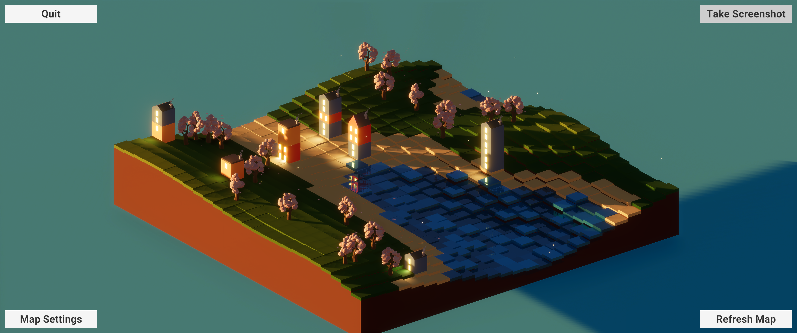

# MinimapMaker

A stylised random tile-based map generator.
This is a showcase and a very relaxing thing to watch, especially when there is a very nice detailed map ;)

### Features
- random map generation
- full day/night cycle
- random lighting
- screenshot function
- dynamic toon style map with particles and playful water movement
- global illumination with multiple light sources 

### Screenshots

.png>)

### [Video example](https://drive.google.com/file/d/1-0o2fnwyJjFIt6ETucr3c4LSsraB96Fy/view?usp=share_link)
